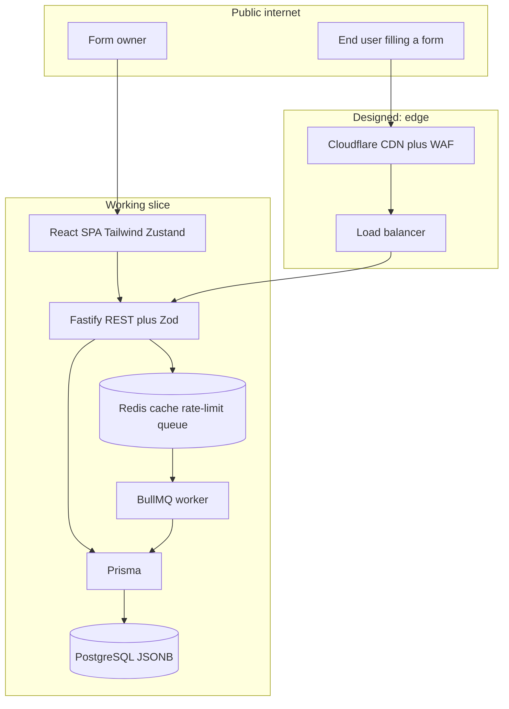
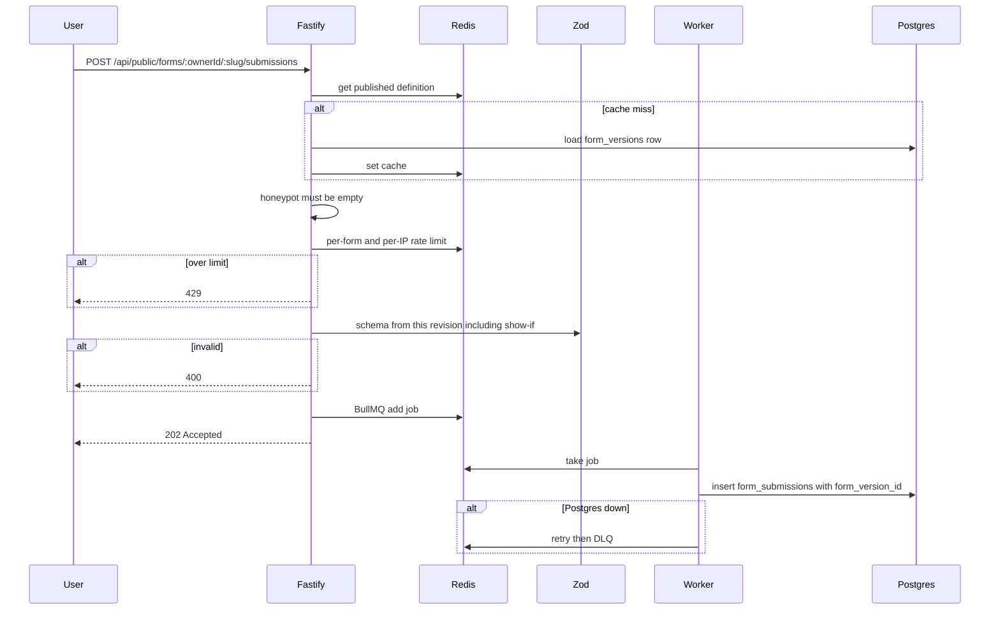

# Architecture — Webform Builder & Submission Platform

This document is the primary deliverable. It describes the whole system, how a submission travels end-to-end, how the design meets scale / reliability / security requirements, the data model, technology choices, and an honest **Built vs Designed** split.

The working slice in this repository is a proof of that architecture, not the entire production system.

---

## 1. Overview

The platform lets a customer (a tenant) design a web form, publish an immutable version of it, share a public URL, and collect submissions from anonymous end-users on the open internet.

Three facts drive every design choice:

1. **The public submit path is the hot path.** A form embedded on a busy site can burst. That path must stay responsive and must not drop accepted submissions.
2. **Form shape is user-defined.** Fields, validation, and “show field B only if field A = X” change per form and per publish. Storage and validation cannot assume a fixed SQL column per field.
3. **History must stay correct.** Editing a draft must not change the live form. A submission must always be interpreted against the exact revision that produced it.

---

## 2. System components



| Component | Role |
|---|---|
| React SPA | Visual editor, preview, public form renderer, submissions inbox. Talks only to the REST API. |
| Fastify | All HTTP. Owner routes (draft, publish, inbox, export). Public routes (serve definition, accept submit). |
| Zod | Shared validators. Form JSON, each field, and submissions **re-derived from the published revision**. |
| Redis | Published-definition cache, per-form rate limits, BullMQ buffer. |
| BullMQ worker | Writes accepted submissions to Postgres with retries and a dead-letter queue. |
| PostgreSQL (Supabase-compatible) | System of record: tenants, drafts, immutable versions, submissions. |
| Load balancer / CDN | Designed in front of Fastify replicas. One replica in the local slice. |

The browser never talks to Postgres or Redis.

---

## 3. Form building

Customers design forms with a **dynamic, user-defined** set of fields. Supported types:

`text`, `email`, `number`, `select`, `multiselect`, `radio`, `checkbox`, `date`

Each field has its own validation rules, required/optional flag, help text, and optional **conditional visibility** (“show field B only if field A = X”). Field order is the array order in the definition JSON. That JSON is independent of React and of any drag-and-drop library.

### Draft vs published

| State | Where it lives | Who can see it |
|---|---|---|
| Draft | `forms.draft_definition` (mutable) | Owner only |
| Published | `form_versions.definition` (immutable) | Anyone with the public slug |

- Saving in the editor **only** updates `draft_definition`.
- The public page **never** reads the draft.
- Publishing copies the current draft into a **new** `form_versions` row and points `forms.published_version_id` at it. Previous version rows are never updated.

That is how editing cannot affect the live form, and how every submission stays tied to the exact revision that produced it.

Two version numbers are kept separate:

- **`schemaVersion`** (inside the JSON) — version of *our* document format. Today always `1`. Future format changes get a migrator (`migrateV1toV2`) run in memory when reading old rows. Stored versions are not rewritten in place.
- **`revision`** (SQL column on `form_versions`) — content history of one form (Name+Email is revision 1; adding Phone is revision 2).

---

## 4. Public serving

`GET /api/public/forms/:ownerId/:slug`

- Returns **only** the frozen published JSON (and metadata needed to render it).
- 404 if the form has never been published.
- Fastify serves this from Redis when possible; on miss it loads `published_version_id` → `form_versions.definition`, then caches.

The public UI is a generic renderer. It maps `fields[]` to inputs. It applies:

- client-side validation from the same field rules the server uses
- the same `visibility` rules (hide field B until field A equals X)

There is no hardcoded field list per form.

---

## 5. End-to-end submission path

This is the path the architecture is built around.



Step by step:

1. The user POSTs JSON to the public submit endpoint.
2. Fastify loads the **published** revision (Redis, then Postgres).
3. **Spam / abuse:** a honeypot field must be empty. Designed later: CAPTCHA and edge bot management.
4. **Per-form rate limit** in Redis (and per IP). Over limit → **429**, nothing is enqueued.
5. **Server-side validation** is **re-derived from that revision’s JSON** (Zod), including conditionals. Hidden fields are not required. Unknown keys are rejected. The client is never trusted.
6. The validated payload is written to **BullMQ**. The HTTP response is **202 only after the queue accepts the job**.
7. The worker inserts `form_submissions` with `form_id`, `form_version_id`, `payload`, and an idempotency key.
8. If Postgres is slow or down, the job retries. Poison messages go to a dead-letter queue. They are not dropped.

The user has a durability guarantee (queue accept) before the database row exists. That is how we stay responsive during a spike without losing an accepted submit.

---

## 6. Submission access

Owners view submissions for **their** forms only (`owner_id` + `form_id`).

| Need | How |
|---|---|
| Paginated | Cursor on `(form_id, created_at DESC, id)`. Not `OFFSET` — OFFSET gets slower as the table grows. |
| Filterable | Date range and form revision in the slice. JSONB is not the primary lookup path. |
| Export | CSV streamed from the same indexed query. Column labels come from **each row’s** `form_version.definition`, so old answers keep old labels. |
| Large volume | Slice: indexed `WHERE form_id = $1` plus streaming export. Designed: table partitioning, read replicas, async export to object storage. |

---

## 7. How the design meets scale, reliability, and security

### Bursty public load

The submit handler does **not** wait on a Postgres insert. It validates against a cached definition, checks rate limits in Redis, and enqueues. Workers drain the queue independently and can be scaled on queue depth.

Designed in front of that: Cloudflare (TLS, cache of GET definition, WAF) and a load balancer across Fastify replicas.

### No lost submissions

- 202 is returned only after BullMQ has the job.
- Slice: Redis with AOF so a process restart does not wipe the buffer.
- Worker retries with backoff; DLQ for payloads that can never insert.
- Idempotency key so a retry cannot create a duplicate row.
- Designed production buffer: SQS (or Kafka) with a DLQ — stronger multi-AZ durability than a single Redis.

### Tenant isolation

- Every owner query is scoped by `owner_id`. There is no “list all submissions” API.
- Public routes key by `slug` and return only published JSON, never drafts and never other tenants’ inboxes.
- Per-form rate limits keep one viral form from saturating ingest as easily.
- Designed: per-tenant queue weights / worker fairness so a noisy tenant cannot starve others; Postgres RLS on Supabase as defense in depth.

### Correctness under component failure

| Failure | What happens |
|---|---|
| Fastify crash after enqueue | Job is already in Redis; worker still writes the row. |
| Postgres down | Jobs retry; HTTP path can still accept until the queue is full. |
| Redis cache miss / flush | Definitions reload from Postgres. Cache is not the source of truth. |
| Redis / queue down | Submit returns 503. We do **not** pretend success. (Designed: SQS is independent of the cache Redis.) |
| Owner edits or republishes | New `form_versions` row. Old submissions still point at old rows. Definitions are never UPDATEd. |

### Data integrity across republish

`form_submissions.form_version_id` is a foreign key to an immutable row. The inbox and export join that row for labels and types. Adding a Phone field in revision 2 cannot change how revision 1 answers are read.

### Security (public, user-generated surface)

Form labels, help text, options, and submitted values are untrusted.

- React renders them as text. No `dangerouslySetInnerHTML` for definition strings.
- Closed field-type whitelist. No user HTML, no user JavaScript, no user regex (avoids ReDoS).
- Zod `.strict()` on submissions.
- Content-Security-Policy on public pages (web headers); API responses use a restrictive CSP
- Honeypot + per-form rate limits in the slice; CAPTCHA / bot fight designed at the edge.

---

## 8. Data model

Relational columns hold identity, ownership, status, revision numbers, and timestamps. **JSONB** holds the flexible form definition and the submission payload. There is **no table per field type**.

### `users`

Owner of forms. `id` (UUID PK), `email` (unique).

### `forms`

Form identity and the **mutable draft**.

| Column | Purpose |
|---|---|
| `id` | UUID PK |
| `owner_id` | FK → `users.id` |
| `title` | Working title |
| `slug` | Unique public URL key |
| `status` | `draft` \| `published` |
| `published_version_id` | FK → live `form_versions.id`, null if never published |
| `draft_definition` | JSONB, editor working copy |

Indexes: unique `slug`, index `owner_id`, unique `published_version_id`.

### `form_versions`

Immutable snapshots. **`definition` is never updated.**

| Column | Purpose |
|---|---|
| `id` | UUID PK |
| `form_id` | FK → `forms.id` |
| `revision` | 1, 2, 3… per form |
| `schema_version` | Copy of JSON `schemaVersion` |
| `definition` | Frozen form JSON |
| `published_at` | Timestamp |

Unique `(form_id, revision)`.

### `form_submissions`

| Column | Purpose |
|---|---|
| `id` | UUID PK |
| `form_id` | FK, for fast inbox queries |
| `form_version_id` | FK to the exact revision |
| `payload` | JSONB answers keyed by field `name` |
| `idempotency_key` | Unique, worker retries |
| `created_at` | Timestamp |

Index `(form_id, created_at DESC)` for pagination and export. Index `form_version_id`.

### Why JSONB (not a column per field, not Mongo as primary)

Field sets change per publish. `ALTER TABLE` for every new phone field cannot work. Mongo would store flexible documents, but tenants, immutable versions, and “this submission belongs to this frozen revision” are relational integrity problems. Postgres JSONB gives flexibility **and** foreign keys / transactions.

Submission payload example:

```json
{ "email": "a@b.com", "plan": "pro" }
```

Labels for `email` / `plan` are read from the linked `form_versions.definition`, not from the current draft.

### Form JSON (shape)

```json
{
  "schemaVersion": 1,
  "meta": { "title": "Newsletter", "description": "" },
  "settings": { "submitLabel": "Subscribe", "successMessage": "Thanks." },
  "fields": [
    {
      "id": "fld_…",
      "type": "email",
      "name": "email",
      "label": "Email",
      "placeholder": "you@company.com",
      "helpText": "",
      "required": true,
      "validation": { "maxLength": 254 },
      "options": [],
      "visibility": { "mode": "always" }
    }
  ]
}
```

Conditional example: `"visibility": { "mode": "when", "fieldId": "fld_plan", "operator": "eq", "value": "other" }`.

---

## 9. Technology choices

| Concern | Choice | Why | Trade-off |
|---|---|---|---|
| Language | TypeScript | One `FormDefinition` type for editor, public renderer, and server Zod. | Not the absolute fastest ingest language (Go). Correctness of dynamic schema matters more here. |
| Serving (UI) | React + Tailwind + Zustand | Visual editor and dynamic public renderer. Zustand is editor-local; the server is source of truth after save. | SPA must be hosted beside the API (Vite in the slice). |
| Serving (API) | Node.js + Fastify | Low-overhead HTTP, plugin split between owner and public routes. Ingest is its own process so it can scale apart from the UI. | Two processes vs a Next.js monolith. |
| Validation | Zod, compiled from the revision | Same library on client and server. Submission schema is **not** global — it is built from the frozen JSON. | Slightly more code than a single static schema. |
| Storage | PostgreSQL JSONB + Prisma | FKs, transactions, JSONB, readable migrations. Production hosting: Supabase. Slice: Compose Postgres, same schema. | JSONB filters are weaker than typed columns; we query by `form_id` + time first. |
| Buffer / queue | Redis + BullMQ (slice); SQS (designed) | Absorbs bursts; retries; DLQ. Docker-friendly for one-command run. | Redis AOF is weaker than SQS multi-AZ. Documented in Built vs Designed. |
| Cache | Redis | Published definitions on GET/POST. Cache is disposable. | Must invalidate on publish. |
| Rate limit | Redis token bucket per `form_id` (+ IP) | Required on the public path; cheap; does not hit Postgres. | Approximate fairness, not a global quota service. |
| Load balancing | Designed: Cloudflare / ALB / Nginx in front of N Fastify replicas | Horizontal ingest. | One replica in Compose. |
| Auth | Slice: `owner_id` on routes (seeded user). Designed: Supabase Auth + RLS | Enough to prove isolation; not a full IdP. | Real SSO is designed, not built. |

---

## 10. API surface

Owner (always scoped by `owner_id`):

| Method | Path | Purpose |
|---|---|---|
| POST | `/api/forms` | Create form + empty draft |
| GET | `/api/forms` | List my forms |
| GET | `/api/forms/:id` | Form + draft |
| PATCH | `/api/forms/:id` | Save title / slug / draft |
| POST | `/api/forms/:id/publish` | Immutable revision + pointer flip |
| GET | `/api/forms/:id/submissions` | Cursor page + filters |
| GET | `/api/forms/:id/submissions/export` | Streamed CSV |

Public:

| Method | Path | Purpose |
|---|---|---|
| GET | `/api/public/forms/:ownerId/:slug` | Published definition only |
| POST | `/api/public/forms/:ownerId/:slug/submissions` | Honeypot, rate limit, Zod, enqueue, 202 |

Publish is one database transaction: insert `form_versions`, set `published_version_id`, set `status = published`, invalidate Redis cache.

---

## 11. Built vs Designed

### Built (this repository)

- React + Tailwind + Zustand visual editor: all listed field types, validation rules, required flag, help text, conditional visibility, reorder, draft save, publish, preview
- Public form page rendered from the published JSON, with client validation and the same conditionals
- Fastify REST as above
- Zod re-derived from the published revision on the server
- Honeypot + per-form Redis rate limiting
- Redis cache of published definitions
- BullMQ worker persisting submissions with `form_version_id` and idempotency
- Prisma schema: `users`, `forms`, `form_versions`, `form_submissions`
- Local run: Supabase Postgres + Redis for Windows (or Compose when Docker is available)
- Cursor-paginated, filterable inbox and streamed CSV export
- Load generator (`npm run load:setup` / `npm run load`) against the public submit path
- Automated tests: dynamic server validation (including show-if); submission integrity after republish

### Designed, not built

- Full one-command `docker compose up --build` for all services (Compose file exists; optional when Docker is available)
- Cloudflare CDN, WAF, bot management, CAPTCHA
- Load balancer and autoscaling Fastify + worker replicas (scale on queue depth)
- Hosted Supabase Auth, Row Level Security, point-in-time recovery
- SQS or Kafka as the durable ingest bus (instead of Redis/BullMQ)
- Postgres partitioning of `form_submissions`, read replicas
- Async export to object storage for multi-million-row forms
- Billing, teams, audit log, multi-region

Built in this repo (beyond the original slice): JWT auth for the dashboard, and publish-time iframe / JavaScript embed (`/f/:ownerId/:slug?embed=true`, `/embed.js`).

The slice exists to prove the core loop and the invariants. The designed pieces are how this same contract would run on the public internet at high scale.
